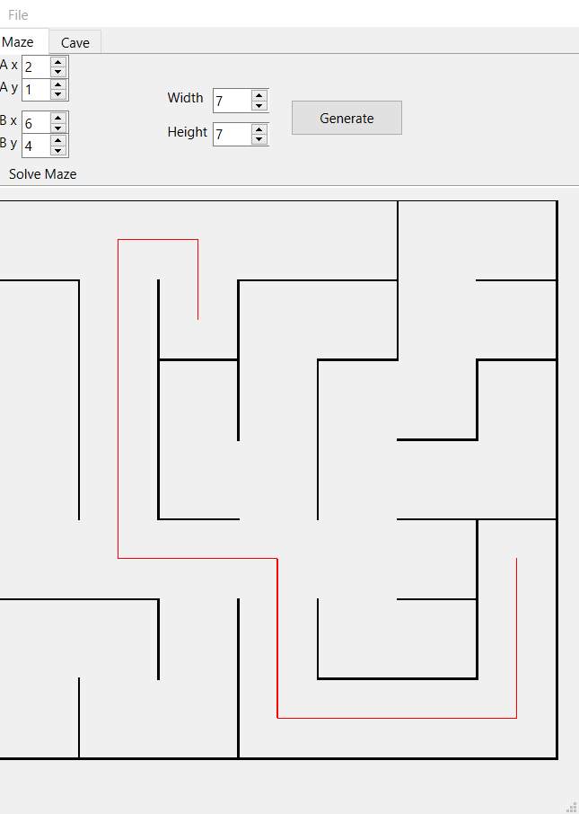
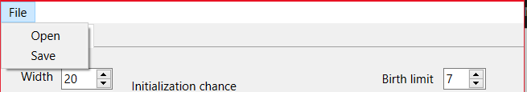

# Maze

В данном проекте реализованы алгоритмы создания идеального лабиринта, поиска пути и генерации пещер. 
Графический интерфейс реализован с помощью фреймворка Qt.

### Вкладка Maze
Вкладка *Maze* отвечается за создание идеального лабиринта и поиск пути в нём. 
Для создания идеального лабиринта используется алгоритм Эллера. 
Для поиска пути используется алгоритм Ли.

- Поля *Ax*, *Ay* отвечают за ввод координат первой точки
- Поля *Bx*, *By* отвечают за ввод координат второй точки
- Поля *Width*, *Height* отвечают за ввод размера лабиринта
- Кнопка *Generate* отобразит случайно сгенерированный лабиринт

### Вкладка Cave
Вкладка *Cave* отвечается за создание пещер с использованим клеточного автомата. 

- Поля *Width*, *Height* отвечают за ввод размера пещеры
- Поле *Initialization chance* отвечает за ввод шанса создания живой клетки
- Поле *Birth limit* определяет предел "рождения" клетки
- Поле *Death limit* определяет предел "смерти" клетки
- Кнопка *Generate* отобразит случайно сгенерированную пещеру
- Кнопка *Step* отобразит следующую итерацию
- Кнопка *Start* начнёт отображать следующие итерации каждые *Delay* пока есть живые клетки
- Поле *Delay* определяет время между итерациями

### Вкладка File
Вкладка *File* отвечается за загрузку лабиринта/пещеры из файла и сохранение лабиринта/пещеры. 

