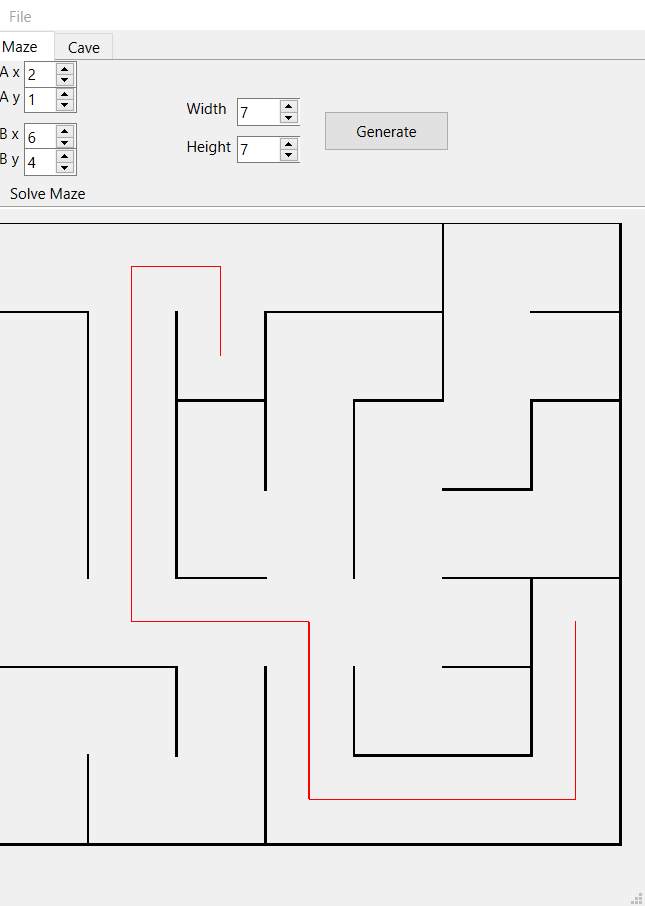
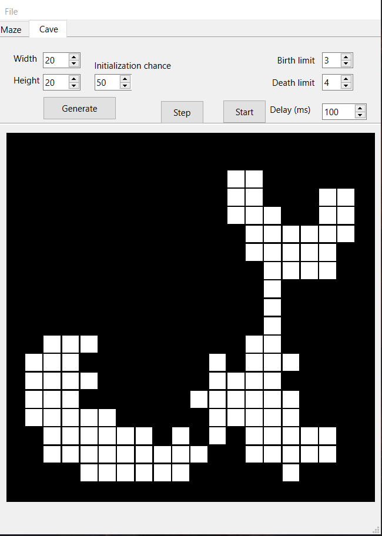

В данном проекте реализованы алгоритмы создания идеального лабиринта, поиска пути и генерации пещер.

При запуске программы откроется интерфейс по отображению лабиринта. Значения по умолчанию: 3х3.
При нажатии кнопки "generate" будет случайно сгенерирован новый лабиринт.
Далее в поле А можно указать точку отправления (отсчет ведется по координатам от 0х0), а в B - точку
назначения.
Путь от А до B будет отображен красным цветом.

Во втором блоке, Cave, рисуются пещеры. Есть возможно выбрать ширину и высоту поля, а также шанс
появления свободных клеток.
Чем он выше, тем больше вероятность, что поле будет более пустым. При нажатии кнопки "generate"
сформируется первоначальное состояние.
Далее необходимо указать условия, при которых пещеры будут заполняться - это Birth Limit и Death
Limit. От этих значений зависит при скольких
соседних клетках клетка будет "оживать" (появляться) и при скольких будет "умирать" (исчезать)
соответственно.

